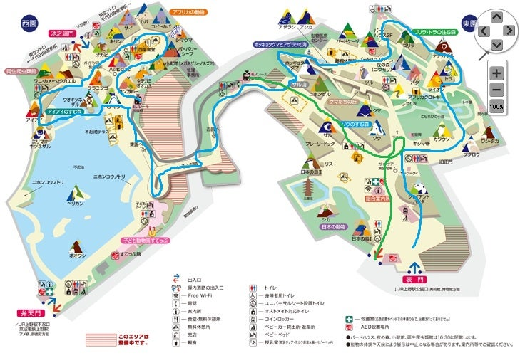

# 〜上野の旅〜

## 12:00 [湯島天神横ラクレット](https://raclette.jp/shop2.php) 集合
***※似た名前の店（湯島ワンズラクレット）があるので間違えないように気をつけて***

## 13:30〜15:30 上野動物園
地図と歩き方  

## 15:45〜17:00 国立博物館

_if (動物園で歩き疲れたら) or (動物園が伸びたら) ；_
　　
  
  
 ***博物館はキャンセルして、先に新宿に移動して、サザンテラス等で座って話そう！***

## 17:15〜18:00 移動（上野→新宿）

## 18:15〜21:00 [韓国焼肉・百済](https://www.google.com/url?q=https://s.tabelog.com/tokyo/A1304/A130401/13041882&sa=U&sqi=2&ved=2ahUKEwiuw93X6vCGAxUGhq8BHQ39CqcQFnoECA4QAQ&usg=AOvVaw3fB9WUQzeYIx28GfEQMG91)
